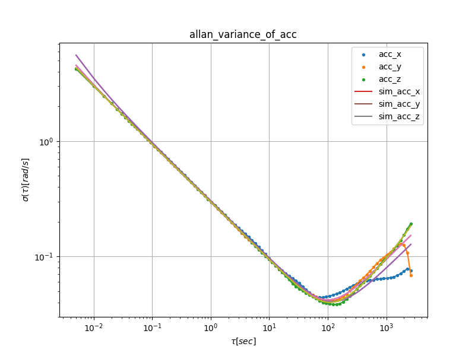

# IMU Allan Variance

**REFERENCES**

- [gaowenliang/imu_utils](https://github.com/gaowenliang/imu_utils)
- [rpng/kalibr_allan](https://github.com/rpng/kalibr_allan)
- N. El-Sheimy, H. Hou and X.
  Niu, "[Analysis and Modeling of Inertial Sensors Using Allan Variance](https://www.researchgate.net/publication/3094132_Analysis_and_Modeling_of_Inertial_Sensors_Using_Allan_Variance)"
  . in IEEE Transactions on Instrumentation and Measurement, vol. 57, no. 1, pp.
  140-149, Jan. 2008, doi: 10.1109/TIM.2007.908635.

The code of this project is mainly based
on [this repository](https://github.com/gaowenliang/imu_utils) and [this repository](https://github.com/mintar/imu_utils), thanks to the
work of [gaowenliang](https://github.com/gaowenliang), [mintar](https://github.com/mintar) et al.

### IMU Noise Values

Parameter | YAML element | Symbol | Units
--- | --- | --- | ---
Gyroscope "white noise" | `gyr_n` |  | 
Accelerometer "white noise" | `acc_n` |  | 
Gyroscope "bias Instability" | `gyr_w` |  | 
Accelerometer "bias Instability" | `acc_w` |  | 

* White noise is at tau=1;

* Bias Instability is around the minimum;

(according to technical report: [`Allan Variance: Noise Analysis for Gyroscopes`](http://cache.freescale.com/files/sensors/doc/app_note/AN5087.pdf "Allan Variance: Noise Analysis for Gyroscopes"))

### Requirements

1. Eigen3
2. Ceres
3. matplotlib

### Usage

1. 编译

```shell
mkdir build
cd build
cmake ..
make -j4
```

2. 准备 采样的数据

put your imu sampled data file "imu_reading.txt" at dir ./data/

3. run allan_variance analysis

```shell
cd build
./imu_allan_variance
```

4. result

在data文件夹下面可以看到数据:

- data_IMUxxxx_acc_t.txt: acc时间戳
- data_IMUxxxx_acc_x.txt: acc采样x轴
- data_IMUxxxx_acc_y.txt: acc采样y轴
- ...
- data_IMUxxxx_sim_acc_t.txt: acc拟合时间戳
- data_IMUxxxx_sim_acc_y.txt: acc拟合y轴曲线
- ...
- IMUxxxx_imu_param.txt: IMU噪声分析解结果

5. 绘制曲线

```shell
cd ./scripts
python3 ./draw_allan.py
```



